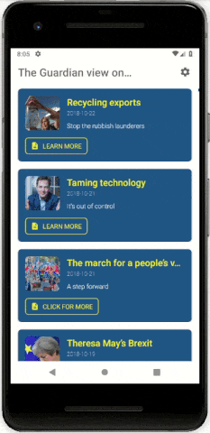

<h1 align="center">The Guardian View</h1>

<strong>News app based on <a href="https://www.theguardian.com/profile/editorial">the editorial section of The Guardian</a></strong>
 First app with real online data 📱🌐✨

 

</img>

<h2>About</h2>
Seventh of eight student projects made in 2017-2018 as part of <a href="https://eu.udacity.com/course/android-basics-nanodegree-by-google--nd803" target="_blank">Udacity's Android Basics Nanodegree</a>.

<h3>☑️ Phase 1 - (Nov. - Feb.):</h3>

1. <a href="https://github.com/r4dixx/LiterallyHelloWorld" target="_blank">Literally Hello World</a>
2. <a href="https://github.com/r4dixx/HelloAndroid" target="_blank">Hello Android</a>
3. <a href="https://github.com/r4dixx/CheesyWinterContest" target="_blank">Cheesy Winter Contest</a>
4. <a href="https://github.com/r4dixx/m32O" target="_blank">m32O</a>

<h3>☑️ Phase 2 - (Feb. - Jul.):</h3>

1. <a href="https://github.com/r4dixx/RookiePlayer" target="_blank">Rookie Player</a>
2. <a href="https://github.com/r4dixx/VisitCalgary" target="_blank">Visit Calgary</a>
3. <strong><a href="https://github.com/r4dixx/TheGuardianView" target="_blank">The Guardian View</a></strong>
4. <a href="https://github.com/r4dixx/Flourish-And-Blotts-Book-Registry" target="_blank">Flourish & Blotts - Book Registry</a>

<h2>Goal and requirements</h2>

App contains a main screen which displays multiple news stories and settings.

Each list item on the main screen must display relevant text, information about the story and a clickable link.

The Settings Activity must be accessible from the Main Activity via a Navigation Drawer or from the toolbar menu. It should allow users to see the preference values right below the preference names, as a summary. When the value changes, the summary should change too.

<h2>Key learnings</h2>

- HTTP networking
- JSON parsing
- AsyncTask
- Loaders
- ConnectivityManager
- PreferenceFragment
- StringBuilder
- Permissions
- SwipeRefreshLayout
- Empty state views
- Random button texts
- Material Design 2018 style

<h2>Installation</h2>

First you'll need to <a href="https://open-platform.theguardian.com/access/" target="_blank">sign up for an API key</a> (it will be sent to you by email).

Once done, you can move on to the next steps:

1. Download this project as zip and extract it
2. Import it in Android Studio
3. Sync Gradle and run on your device/emulator

Or use <a href="https://github.com/cesarferreira/dryrun" target="_blank">`dryrun`</a> by <a href="https://github.com/cesarferreira" target="_blank">@CesarFerreira</a>

Finally, head to the SettingsActivity and replace the default API key `test` by your own.

<strong>Warning!</strong> Your API key is private and should not be shared to anyone.

<h2>Contributing</h2>

This project is open to suggestions and improvements. Simply create a Pull Request and I'll have a look.

The Guardian API documentation can be found <a href="https://open-platform.theguardian.com/documentation/" target="_blank">here</a>.

<h2>Project status</h2>
Open to translations, code improvements, feature suggestions... Any contribution is most welcome!

<h2>Credits</h2>

- Author: <a href="https://twitter.com/r4dixx" target="_blank">Amaël Sikel</a>
- All content including icon, text, links and color palette is from <a href="https://www.theguardian.com" target="_blank">The Guardian</a>
- <a href="https://gitmoji.carloscuesta.me/" target="_blank">Gitmoji</a>, an emoji guide for your commit messages by <a href="https://github.com/carloscuesta" target="_blank">carloscuesta</a>

<h2>Copyright</h2>
This project is licensed under the terms of the MIT license and protected by Udacity Honor Code and Community Code of Conduct. See <a href="LICENSE.md">license</a> and <a href="LICENSE.DISCLAIMER.md">disclaimer</a>.
